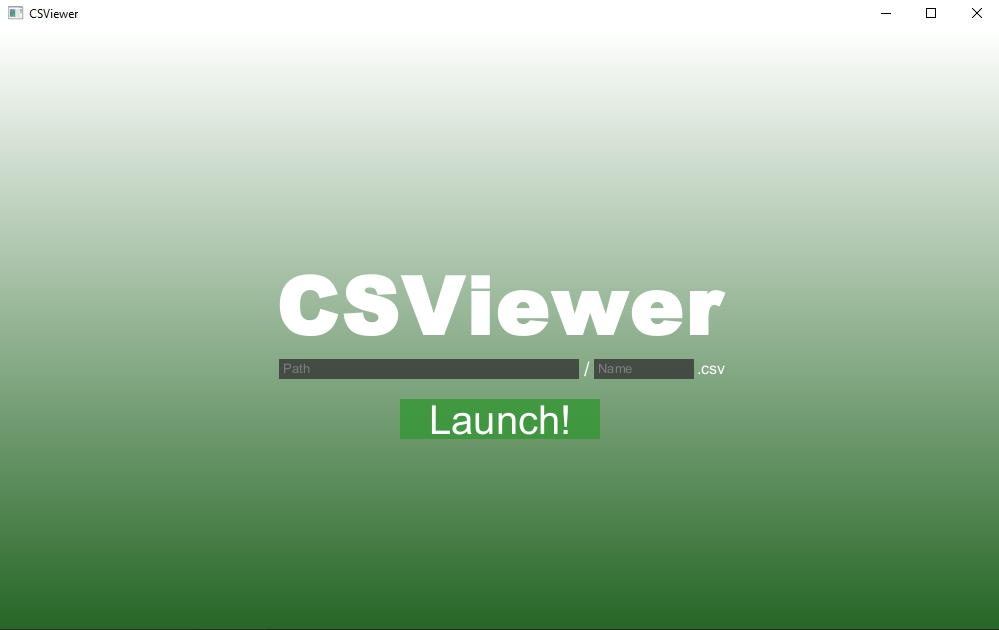
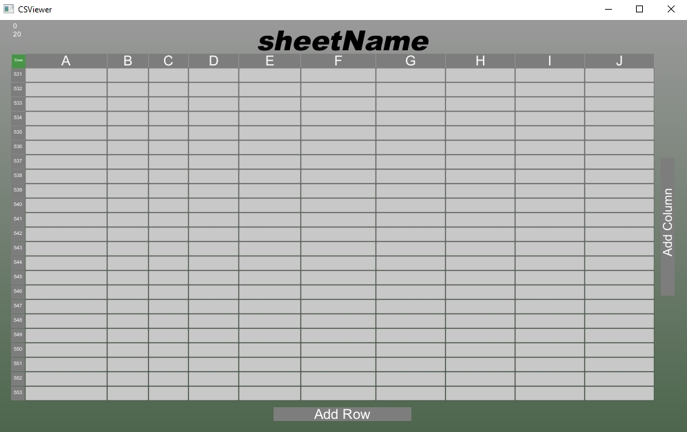
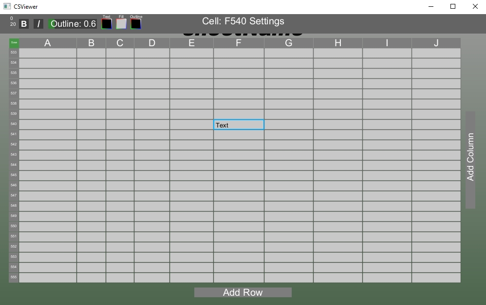

# CSViewer
CSViewer is a CSV Viewer spreadsheet-like program coded using GlowUI and GlowLib

A couple things bothered me about storing very private data using EXCEL or Sheets; I don't know how secure my data really is, and I dont want to have to pay a premium to use a service.
So, I decided to make my own spreadsheet viewer called CSViewer, targetted at editing CSV files in a spreadsheet-type document so that I may trust the program I am using to store my data

The program starts off with a file select screen where you can type the file name and path of the CSV file you want to edit

After launching the CSV file, you will be brought to an interactable grid-scene where you can edit cells, columns, and rows, visually and textually. To save a file, click the little green button in the top left of the scene

Left click on a cell to begin typing, Right click on a cell, column, or row to enter editor mode. In editor mode, a settings bar will appear with different modifications including bold, italic, outline, and colors

The Program current has issues editing very large CSV files, but the intention of creating this program was for data privacy in the form of passwords and smaller information logs, so the bugfix is not my top priorty
